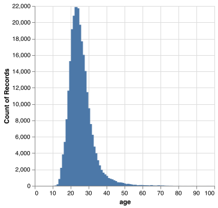
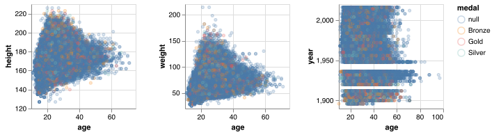
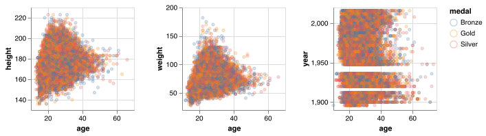
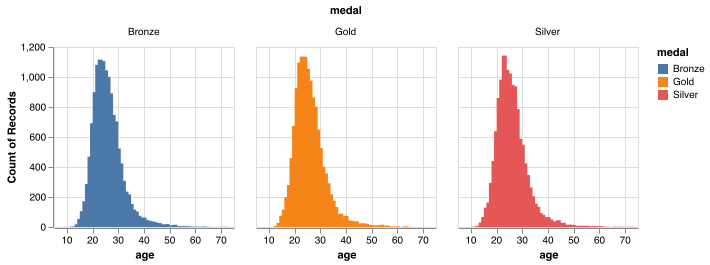

# Summary

Here we attempt to perform a hypothesis test on the question, “Is the
proportion of athletes younger than 25 that win a medal greater than the
proportion of athletes of age 25 or older that win a medal?”. Our final
result was very conclusive, since we got a p-value of 1 in our
hypothesis test. We used simulation methods to generate our null
hypothesis and placed our observed test statistic on it to find a
visually consistent answer with the p-value. We did not have enough
statistical evidence to say that the proportions mentioned are not
equal.

# Introduction

It is known that Olympic athletes require to train year after year for
their shot at winning a medal for their country. In addition to physical
strength, the right mental state is very important for success in these
events. It is a common conception to think that the younger the athlete,
the stronger and the more likely it is for him/her to win a spot on the
podium. But is that enough to win a medal? Does experience play a more
important role? For this project we will attempt to make a hypothesis
test to answer the question - is the proportion of athletes younger than
25 that win a medal greater than the proportion of athletes of age 25 or
older that win a medal?

**Limitations and assumptions**:

-   The age threshold of 25 years old was chosen on intuition. If time
    was provided, a way to make this analysis more robust would be to
    make some research and talk to some domain experts to find out if 25
    years old is a good threshold to set for this hypothesis test.

-   The data set contains information from the years 1896 - 2016,
    therefore, the analysis is taking into consideration all of these
    records, and the result should be interpreted as the comparison of
    the proportions mentioned within that time span. The analysis could
    be improved and give more specific insight if athletes were grouped
    by years (for example, before 1950 and after 1950) or by season
    (winter/summer games).

-   The same athlete could appear in the same event for several years.
    If this is the case, each appearance will be taken as a different
    record, since we are taking into account each combination of
    athlete-event-games.

# Methods

R programming language (R Core Team 2021) and the following R packages
were used to perform the analysis:

-   tidyverse (Wickham et al. 2019)

-   knitr (Xie 2021)

-   infer (Bray et al. 2021)

-   broom (Robinson, Hayes, and Couch 2021)

-   docopt (de Jonge 2020)

-   kableExtra (Zhu 2021)

Also, python language (Python Core Team 2019a) and the following
packages were used for the EDA:

-   os (Python Core Team 2019b)

-   altair (VanderPlas et al. 2018)

-   pandas (McKinney 2010)

# Exploratory Data Analysis

Here is the URL of our data source:

<https://github.com/rfordatascience/tidytuesday/tree/master/data/2021/2021-07-27>

Direct download links to individual CSV files:

The only file we need for our purpose:

<https://github.com/rfordatascience/tidytuesday/raw/master/data/2021/2021-07-27/olympics.csv>

Other files:

<https://github.com/rfordatascience/tidytuesday/raw/master/data/2021/2021-07-27/athlete_events.csv>
<https://github.com/rfordatascience/tidytuesday/raw/master/data/2021/2021-07-27/noc_regions.csv>
<https://github.com/rfordatascience/tidytuesday/raw/master/data/2021/2021-07-27/regions.csv>

Based on the source page, we understand that we really need the
`olympics.csv` file which is the cleaned version of the file
`athlete.csv`. The other 2 files only contains redundant information as
far as our analytic objective is concerned. So we are going to do EDA on
the `olympics.csv` file here.

The data dictionary is available here:

<https://github.com/rfordatascience/tidytuesday/tree/master/data/2021/2021-07-27#olympicscsv>

And I am including it for your convenience:

<table>
<thead>
<tr class="header">
<th style="text-align: left;">variable</th>
<th style="text-align: left;">class</th>
<th style="text-align: left;">description</th>
</tr>
</thead>
<tbody>
<tr class="odd">
<td style="text-align: left;">id</td>
<td style="text-align: left;">double</td>
<td style="text-align: left;">Athlete ID</td>
</tr>
<tr class="even">
<td style="text-align: left;">name</td>
<td style="text-align: left;">character</td>
<td style="text-align: left;">Athlete Name</td>
</tr>
<tr class="odd">
<td style="text-align: left;">sex</td>
<td style="text-align: left;">character</td>
<td style="text-align: left;">Athlete Sex</td>
</tr>
<tr class="even">
<td style="text-align: left;">age</td>
<td style="text-align: left;">double</td>
<td style="text-align: left;">Athlete Age</td>
</tr>
<tr class="odd">
<td style="text-align: left;">height</td>
<td style="text-align: left;">double</td>
<td style="text-align: left;">Athlete Height in cm</td>
</tr>
<tr class="even">
<td style="text-align: left;">weight</td>
<td style="text-align: left;">double</td>
<td style="text-align: left;">Athlete weight in kg</td>
</tr>
<tr class="odd">
<td style="text-align: left;">team</td>
<td style="text-align: left;">character</td>
<td style="text-align: left;">Country/Team competing for</td>
</tr>
<tr class="even">
<td style="text-align: left;">noc</td>
<td style="text-align: left;">character</td>
<td style="text-align: left;">noc region</td>
</tr>
<tr class="odd">
<td style="text-align: left;">games</td>
<td style="text-align: left;">character</td>
<td style="text-align: left;">Olympic games name</td>
</tr>
<tr class="even">
<td style="text-align: left;">year</td>
<td style="text-align: left;">double</td>
<td style="text-align: left;">Year of olympics</td>
</tr>
<tr class="odd">
<td style="text-align: left;">season</td>
<td style="text-align: left;">character</td>
<td style="text-align: left;">Season either winter or summer</td>
</tr>
<tr class="even">
<td style="text-align: left;">city</td>
<td style="text-align: left;">character</td>
<td style="text-align: left;">City of Olympic host</td>
</tr>
<tr class="odd">
<td style="text-align: left;">sport</td>
<td style="text-align: left;">character</td>
<td style="text-align: left;">Sport</td>
</tr>
<tr class="even">
<td style="text-align: left;">event</td>
<td style="text-align: left;">character</td>
<td style="text-align: left;">Specific event</td>
</tr>
<tr class="odd">
<td style="text-align: left;">medal</td>
<td style="text-align: left;">character</td>
<td style="text-align: left;">Medal (Gold, Silver, Bronze or NA)</td>
</tr>
</tbody>
</table>

Let’s load the data and find out more.

<table>
<caption>
Table 1: Summary information of data
</caption>
<thead>
<tr>
<th style="text-align:left;">
</th>
<th style="text-align:left;">
id
</th>
<th style="text-align:left;">
name
</th>
<th style="text-align:left;">
sex
</th>
<th style="text-align:left;">
age
</th>
<th style="text-align:left;">
height
</th>
<th style="text-align:left;">
weight
</th>
<th style="text-align:left;">
team
</th>
<th style="text-align:left;">
noc
</th>
<th style="text-align:left;">
games
</th>
<th style="text-align:left;">
year
</th>
<th style="text-align:left;">
season
</th>
<th style="text-align:left;">
city
</th>
<th style="text-align:left;">
sport
</th>
<th style="text-align:left;">
event
</th>
<th style="text-align:left;">
medal
</th>
</tr>
</thead>
<tbody>
<tr>
<td style="text-align:left;">
</td>
<td style="text-align:left;">
Min. : 1
</td>
<td style="text-align:left;">
Length:261642
</td>
<td style="text-align:left;">
Length:261642
</td>
<td style="text-align:left;">
Min. :10.0
</td>
<td style="text-align:left;">
Min. :127
</td>
<td style="text-align:left;">
Min. : 25
</td>
<td style="text-align:left;">
Length:261642
</td>
<td style="text-align:left;">
Length:261642
</td>
<td style="text-align:left;">
Length:261642
</td>
<td style="text-align:left;">
Min. :1896
</td>
<td style="text-align:left;">
Length:261642
</td>
<td style="text-align:left;">
Length:261642
</td>
<td style="text-align:left;">
Length:261642
</td>
<td style="text-align:left;">
Length:261642
</td>
<td style="text-align:left;">
Length:261642
</td>
</tr>
<tr>
<td style="text-align:left;">
</td>
<td style="text-align:left;">
1st Qu.: 34755
</td>
<td style="text-align:left;">
Class :character
</td>
<td style="text-align:left;">
Class :character
</td>
<td style="text-align:left;">
1st Qu.:21.0
</td>
<td style="text-align:left;">
1st Qu.:168
</td>
<td style="text-align:left;">
1st Qu.: 60
</td>
<td style="text-align:left;">
Class :character
</td>
<td style="text-align:left;">
Class :character
</td>
<td style="text-align:left;">
Class :character
</td>
<td style="text-align:left;">
1st Qu.:1964
</td>
<td style="text-align:left;">
Class :character
</td>
<td style="text-align:left;">
Class :character
</td>
<td style="text-align:left;">
Class :character
</td>
<td style="text-align:left;">
Class :character
</td>
<td style="text-align:left;">
Class :character
</td>
</tr>
<tr>
<td style="text-align:left;">
</td>
<td style="text-align:left;">
Median : 68198
</td>
<td style="text-align:left;">
Mode :character
</td>
<td style="text-align:left;">
Mode :character
</td>
<td style="text-align:left;">
Median :24.0
</td>
<td style="text-align:left;">
Median :175
</td>
<td style="text-align:left;">
Median : 70
</td>
<td style="text-align:left;">
Mode :character
</td>
<td style="text-align:left;">
Mode :character
</td>
<td style="text-align:left;">
Mode :character
</td>
<td style="text-align:left;">
Median :1988
</td>
<td style="text-align:left;">
Mode :character
</td>
<td style="text-align:left;">
Mode :character
</td>
<td style="text-align:left;">
Mode :character
</td>
<td style="text-align:left;">
Mode :character
</td>
<td style="text-align:left;">
Mode :character
</td>
</tr>
<tr>
<td style="text-align:left;">
</td>
<td style="text-align:left;">
Mean : 68291
</td>
<td style="text-align:left;">
NA
</td>
<td style="text-align:left;">
NA
</td>
<td style="text-align:left;">
Mean :25.6
</td>
<td style="text-align:left;">
Mean :175
</td>
<td style="text-align:left;">
Mean : 71
</td>
<td style="text-align:left;">
NA
</td>
<td style="text-align:left;">
NA
</td>
<td style="text-align:left;">
NA
</td>
<td style="text-align:left;">
Mean :1980
</td>
<td style="text-align:left;">
NA
</td>
<td style="text-align:left;">
NA
</td>
<td style="text-align:left;">
NA
</td>
<td style="text-align:left;">
NA
</td>
<td style="text-align:left;">
NA
</td>
</tr>
<tr>
<td style="text-align:left;">
</td>
<td style="text-align:left;">
3rd Qu.:102109
</td>
<td style="text-align:left;">
NA
</td>
<td style="text-align:left;">
NA
</td>
<td style="text-align:left;">
3rd Qu.:28.0
</td>
<td style="text-align:left;">
3rd Qu.:183
</td>
<td style="text-align:left;">
3rd Qu.: 79
</td>
<td style="text-align:left;">
NA
</td>
<td style="text-align:left;">
NA
</td>
<td style="text-align:left;">
NA
</td>
<td style="text-align:left;">
3rd Qu.:2004
</td>
<td style="text-align:left;">
NA
</td>
<td style="text-align:left;">
NA
</td>
<td style="text-align:left;">
NA
</td>
<td style="text-align:left;">
NA
</td>
<td style="text-align:left;">
NA
</td>
</tr>
<tr>
<td style="text-align:left;">
</td>
<td style="text-align:left;">
Max. :135571
</td>
<td style="text-align:left;">
NA
</td>
<td style="text-align:left;">
NA
</td>
<td style="text-align:left;">
Max. :97.0
</td>
<td style="text-align:left;">
Max. :226
</td>
<td style="text-align:left;">
Max. :214
</td>
<td style="text-align:left;">
NA
</td>
<td style="text-align:left;">
NA
</td>
<td style="text-align:left;">
NA
</td>
<td style="text-align:left;">
Max. :2016
</td>
<td style="text-align:left;">
NA
</td>
<td style="text-align:left;">
NA
</td>
<td style="text-align:left;">
NA
</td>
<td style="text-align:left;">
NA
</td>
<td style="text-align:left;">
NA
</td>
</tr>
<tr>
<td style="text-align:left;">
</td>
<td style="text-align:left;">
NA
</td>
<td style="text-align:left;">
NA
</td>
<td style="text-align:left;">
NA
</td>
<td style="text-align:left;">
NA
</td>
<td style="text-align:left;">
NA’s :51574
</td>
<td style="text-align:left;">
NA’s :54263
</td>
<td style="text-align:left;">
NA
</td>
<td style="text-align:left;">
NA
</td>
<td style="text-align:left;">
NA
</td>
<td style="text-align:left;">
NA
</td>
<td style="text-align:left;">
NA
</td>
<td style="text-align:left;">
NA
</td>
<td style="text-align:left;">
NA
</td>
<td style="text-align:left;">
NA
</td>
<td style="text-align:left;">
NA
</td>
</tr>
</tbody>
</table>

The data, after removing rows with `age` missing because we focus on
`age` in our analysis, has 261642 rows and 15 columns. Here are more
information as we examine the dataframe.

Let’s also sample a few rows from the data:

<table>
<caption>
Table 2: Sample rows from data
</caption>
<thead>
<tr>
<th style="text-align:right;">
id
</th>
<th style="text-align:left;">
name
</th>
<th style="text-align:left;">
sex
</th>
<th style="text-align:right;">
age
</th>
<th style="text-align:right;">
height
</th>
<th style="text-align:right;">
weight
</th>
<th style="text-align:left;">
team
</th>
<th style="text-align:left;">
noc
</th>
<th style="text-align:left;">
games
</th>
<th style="text-align:right;">
year
</th>
<th style="text-align:left;">
season
</th>
<th style="text-align:left;">
city
</th>
<th style="text-align:left;">
sport
</th>
<th style="text-align:left;">
event
</th>
<th style="text-align:left;">
medal
</th>
</tr>
</thead>
<tbody>
<tr>
<td style="text-align:right;">
46458
</td>
<td style="text-align:left;">
Markus Hasler
</td>
<td style="text-align:left;">
M
</td>
<td style="text-align:right;">
34
</td>
<td style="text-align:right;">
171
</td>
<td style="text-align:right;">
68
</td>
<td style="text-align:left;">
Liechtenstein
</td>
<td style="text-align:left;">
LIE
</td>
<td style="text-align:left;">
2006 Winter
</td>
<td style="text-align:right;">
2006
</td>
<td style="text-align:left;">
Winter
</td>
<td style="text-align:left;">
Torino
</td>
<td style="text-align:left;">
Cross Country Skiing
</td>
<td style="text-align:left;">
Cross Country Skiing Men’s 50 kilometres
</td>
<td style="text-align:left;">
NA
</td>
</tr>
<tr>
<td style="text-align:right;">
42977
</td>
<td style="text-align:left;">
Brbel Grimmer
</td>
<td style="text-align:left;">
F
</td>
<td style="text-align:right;">
19
</td>
<td style="text-align:right;">
168
</td>
<td style="text-align:right;">
61
</td>
<td style="text-align:left;">
Germany
</td>
<td style="text-align:left;">
GER
</td>
<td style="text-align:left;">
1964 Summer
</td>
<td style="text-align:right;">
1964
</td>
<td style="text-align:left;">
Summer
</td>
<td style="text-align:left;">
Tokyo
</td>
<td style="text-align:left;">
Swimming
</td>
<td style="text-align:left;">
Swimming Women’s 4 x 100 metres Medley Relay
</td>
<td style="text-align:left;">
NA
</td>
</tr>
<tr>
<td style="text-align:right;">
67080
</td>
<td style="text-align:left;">
Bla Laufer
</td>
<td style="text-align:left;">
M
</td>
<td style="text-align:right;">
20
</td>
<td style="text-align:right;">
165
</td>
<td style="text-align:right;">
58
</td>
<td style="text-align:left;">
Hungary
</td>
<td style="text-align:left;">
HUN
</td>
<td style="text-align:left;">
1976 Summer
</td>
<td style="text-align:right;">
1976
</td>
<td style="text-align:left;">
Summer
</td>
<td style="text-align:left;">
Montreal
</td>
<td style="text-align:left;">
Gymnastics
</td>
<td style="text-align:left;">
Gymnastics Men’s Team All-Around
</td>
<td style="text-align:left;">
NA
</td>
</tr>
<tr>
<td style="text-align:right;">
125792
</td>
<td style="text-align:left;">
Stefana Veljkovi
</td>
<td style="text-align:left;">
F
</td>
<td style="text-align:right;">
18
</td>
<td style="text-align:right;">
190
</td>
<td style="text-align:right;">
76
</td>
<td style="text-align:left;">
Serbia
</td>
<td style="text-align:left;">
SRB
</td>
<td style="text-align:left;">
2008 Summer
</td>
<td style="text-align:right;">
2008
</td>
<td style="text-align:left;">
Summer
</td>
<td style="text-align:left;">
Beijing
</td>
<td style="text-align:left;">
Volleyball
</td>
<td style="text-align:left;">
Volleyball Women’s Volleyball
</td>
<td style="text-align:left;">
NA
</td>
</tr>
<tr>
<td style="text-align:right;">
97977
</td>
<td style="text-align:left;">
Carlos Eduardo Quipo Pilataxi
</td>
<td style="text-align:left;">
M
</td>
<td style="text-align:right;">
26
</td>
<td style="text-align:right;">
156
</td>
<td style="text-align:right;">
49
</td>
<td style="text-align:left;">
Ecuador
</td>
<td style="text-align:left;">
ECU
</td>
<td style="text-align:left;">
2016 Summer
</td>
<td style="text-align:right;">
2016
</td>
<td style="text-align:left;">
Summer
</td>
<td style="text-align:left;">
Rio de Janeiro
</td>
<td style="text-align:left;">
Boxing
</td>
<td style="text-align:left;">
Boxing Men’s Light-Flyweight
</td>
<td style="text-align:left;">
NA
</td>
</tr>
</tbody>
</table>

## Points to note:

1.  Each observation is an athlete-event-games key. In other words, an
    athlete could participate in more than 1 event in the same Olympic
    game, and the same athlete can participate in multiple Olympic
    games;

2.  The columns do not have missing values after removing the rows with
    age missing. Even though `medal` appears to have a lot of missing
    values (‘NA’), they are really not missing because the meaning of
    not having `Gold`, `Silver` or `Bronze` would only mean that the
    athlete concerned did not win any medal. This is normal because
    there is a very small number of medals per event. For the purpose of
    this EDA, we may just treat ‘NA’ as a category together with `Gold`,
    `Silver` and `Bronze`.

3.  `id` is the unique identifier for an athlete and `noc` is the unique
    identifier for an NOC which most often represents a country except
    `IOA` (standing for “Individual Olympic Athlete”) which is the
    representation for athletes without an NOC and similary `ROT`
    (standing for “Refugee Olympic Team”).

## Age Distribution

Let’s see what the age distribution looks like for all athletes:

Figure 1: Age distribution

As can be seen above, the age peaks at 23 years old and the distribution
is bell-shaped and right-skewed, which means that there are a few older
athletes that compete in the olympics.

## Age vs Numeric features

Let’s explore how age correlates with other numeric features.

Figure 2: Age vs Numeric features

It seems difficult to visualize when the class imbalance is with
`medal`, when not having a medal is the majority. Now we try again with
the data only with medals and look at the data again.

Figure 3: Age vs Numeric features (only with medals)

Some high-level insights:

1.  There is some apparent correlation of between height and age and
    between weight and age for those who got medals; and

2.  The maximum age of athletes getting medals seemed to shrink between
    1960s and 1980s, and it seemed to increase again till now.

Perhaps we should simply just look at the relationship between age and
medals…

Figure 4: Age vs Medals

All the modes for `Gold`, `Silver` and `Bronze` appear to be the same as
the overall age distribution as seen in Figure 1 above.

After this initial analysis, we can see that the age threshold of 25
years old lies in a very good spot, a little higher than the mean. This
makes it harder to intuitively predict what the result of the test will
be. Let’s follow this with the analysis!

# Hypothesis Test

## Analysis

To answer our question, we will perform a hypothesis testing. First,
we’ll define *H*0 and *H**A* as below:

*H*0: the proportion of athletes under 25 that win a medal is
equal to the proportion of athletes 25 and older that win a medal.

*H**A*: the proportion of athletes under 25 that win a medal
is greater to the proportion of athletes 25 and older that win a medal.

We will then

1.  Compute the observed test statistic from original sample,

2.  Use the null model to generate 100 random permuted samples from the
    original sample and calculate their corresponding r test statistics,

3.  Generate the null distribution using these r test statistics,

4.  Check if the observed test statistic computed in (1) falls on the
    distribution,

5.  Calculate the p-value to verify the result

The code used to perform the analysis and create this report can be
found here:
[https://github.com/UBC-MDS/olympic\_medal\_htest](https://github.com/UBC-MDS/olympic_medal_htest/)

## Results & Discussion

<table class="table" style="width: auto !important; ">
<caption>
Table 3. Data summary
</caption>
<thead>
<tr>
<th style="text-align:left;">
age
</th>
<th style="text-align:right;">
medal
</th>
<th style="text-align:right;">
n
</th>
<th style="text-align:right;">
prop
</th>
</tr>
</thead>
<tbody>
<tr>
<td style="text-align:left;">
Under
</td>
<td style="text-align:right;">
17939
</td>
<td style="text-align:right;">
131134
</td>
<td style="text-align:right;">
0.137
</td>
</tr>
<tr>
<td style="text-align:left;">
Above
</td>
<td style="text-align:right;">
21112
</td>
<td style="text-align:right;">
130508
</td>
<td style="text-align:right;">
0.162
</td>
</tr>
</tbody>
</table>

We can see from the table above that there are 131,134 athletes under
age of 25 and 13.68% of them got a medal in the event, while there are
130,508 athletes equal to or above the age of 25 and 16.18% of them got
a medal in the event.

Figure 5. Hypothesis testing result

After generating the null distribution, and placing our observed test
statistic on the plot in figure 1, we can see that the observed test
statistics (red line) falls within the significance threshold (blue
line), therefore we fail to reject *H*0.

<table class="table" style="width: auto !important; ">
<caption>
Table 4. p-value for the test.
</caption>
<thead>
<tr>
<th style="text-align:right;">
p-value
</th>
</tr>
</thead>
<tbody>
<tr>
<td style="text-align:right;">
1
</td>
</tr>
</tbody>
</table>

The p-value calculated is 1 and it is higher than the *α* of 0.05. It
leads us to the same conclusion:

We fail to reject the null hypothesis and conclude that it is not
statistically significant that the proportion of athletes younger than
25 that win a medal is greater than the proportion of athletes of age 25
or older that win a medal.

The results show that athletes under 25 have not been more successful in
the olympics in comparison to athletes who are 25 and older. We can
attribute this result to two different factors:

1.  The olympics have many different types of events, and these events
    have been changing through the years. Many of these sports are
    dominated by older athletes, since they require more experience and
    hours put into the sport, rather than physical dexterity. Examples
    for these events could be art competitions (sculpturing, music,
    among others in the 1940’s), archery (1900’s), shooting (1900’s).

2.  For the majority of events, experience still plays a very important
    role in winning a medal.

We also found a couple of papers (Singh 2021) and (Elmenshawy, Machin,
and Tanaka 2015) that suggest that it is more likely for an athlete to
win a medal when he has more experience.

# References

Bray, Andrew, Chester Ismay, Evgeni Chasnovski, Simon Couch, Ben Baumer,
and Mine Cetinkaya-Rundel. 2021. *Infer: Tidy Statistical Inference*.
<https://CRAN.R-project.org/package=infer>.

de Jonge, Edwin. 2020. *Docopt: Command-Line Interface Specification
Language*. <https://CRAN.R-project.org/package=docopt>.

Elmenshawy, Ahmed R, Daniel R Machin, and Hirofumi Tanaka. 2015. “A Rise
in Peak Performance Age in Female Athletes.” *Age* 37 (3): 1–8.

McKinney, Wes. 2010. “Data Structures for Statistical Computing in
Python.” In *Proceedings of the 9th Python in Science Conference*,
edited by Stéfan van der Walt and Jarrod Millman, 51–56.

Python Core Team. 2019a. *Python: A dynamic, open
source programming language*. Python Software Foundation.
<https://www.python.org/>.

———. 2019b. *Python: A dynamic, open source
programming language*. Python Software Foundation.
<https://www.python.org/>.

R Core Team. 2021. *R: A Language and Environment for Statistical
Computing*. Vienna, Austria: R Foundation for Statistical Computing.
<https://www.R-project.org/>.

Robinson, David, Alex Hayes, and Simon Couch. 2021. *Broom: Convert
Statistical Objects into Tidy Tibbles*.
<https://CRAN.R-project.org/package=broom>.

Singh, Dr Preet Deep. 2021. “Olympic Medals: Matter of Nerves.”
*Available at SSRN 3901321*.

VanderPlas, Jacob, Brian E Granger, Jeffrey Heer, Dominik Moritz, Kanit
Wongsuphasawat, Arvind Satyanarayan, Eitan Lees, Ilia Timofeev, Ben
Welsh, and Scott Sievert. 2018. “Altair: Interactive Statistical
Visualizations for Python.” *Journal of Open Source Software* 3 (32):
1057.

Wickham, Hadley, Mara Averick, Jennifer Bryan, Winston Chang, Lucy
D’Agostino McGowan, Romain François, Garrett Grolemund, et al. 2019.
“Welcome to the tidyverse.” *Journal of Open
Source Software* 4 (43): 1686. <https://doi.org/10.21105/joss.01686>.

Xie, Yihui. 2021. *Knitr: A General-Purpose Package for Dynamic Report
Generation in r*. <https://yihui.org/knitr/>.

Zhu, Hao. 2021. *kableExtra: Construct Complex Table with ’Kable’ and
Pipe Syntax*. <https://CRAN.R-project.org/package=kableExtra>.
