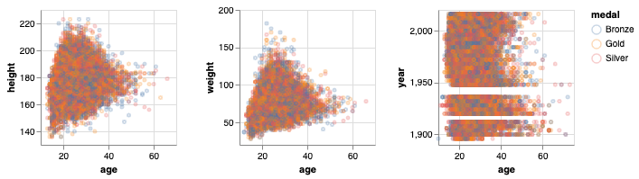
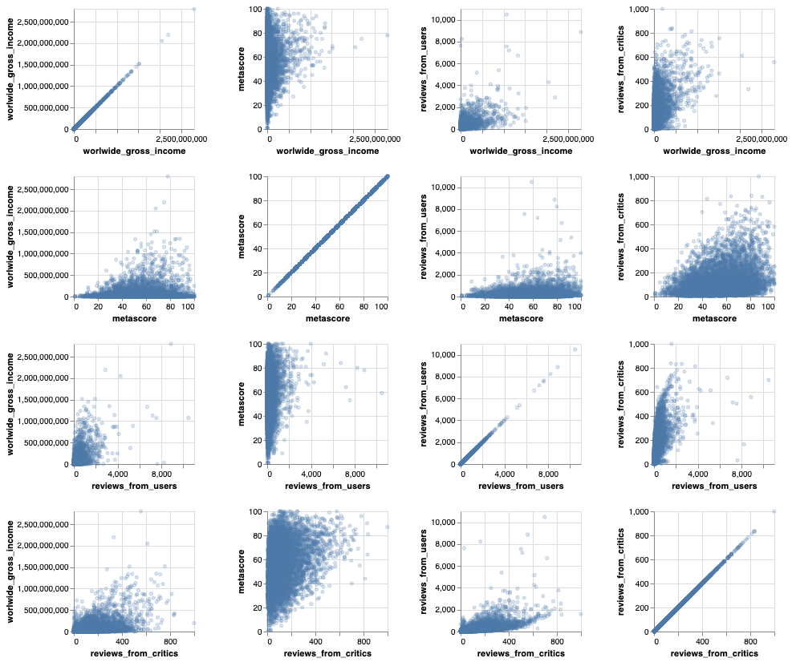
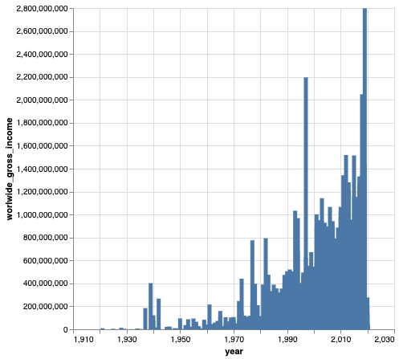

```python
import pandas as pd
import os.path

from sklearn.model_selection import (
    GridSearchCV,
    RandomizedSearchCV,
    cross_val_score,
    cross_validate,
    train_test_split,
)

import altair as alt

# Show an image where the interactive plot is not supported such as on gradescope
alt.renderers.enable('mimetype')
# Handle large data sets without embedding them in the notebook
alt.data_transformers.enable('data_server') 
```


    DataTransformerRegistry.enable('data_server')


# Project: Box Office Predictions
## Exploratory Data Analysis

Here is the URL of our data source:

https://www.kaggle.com/stefanoleone992/imdb-extensive-dataset/download


```python
#url = "https://www.kaggle.com/stefanoleone992/imdb-extensive-dataset/download"
local_path = "../data/raw/IMDb movies.csv"

## Read local file if already exists, otherwise read from URL.
try:
    movies_raw = pd.read_csv(local_path)
except:
    print("Please ensure that the following file is available:\n", local_path)
movies_raw.info()
```

    <class 'pandas.core.frame.DataFrame'>
    RangeIndex: 85855 entries, 0 to 85854
    Data columns (total 22 columns):
     #   Column                 Non-Null Count  Dtype  
    ---  ------                 --------------  -----  
     0   imdb_title_id          85855 non-null  object 
     1   title                  85855 non-null  object 
     2   original_title         85855 non-null  object 
     3   year                   85855 non-null  object 
     4   date_published         85855 non-null  object 
     5   genre                  85855 non-null  object 
     6   duration               85855 non-null  int64  
     7   country                85791 non-null  object 
     8   language               85022 non-null  object 
     9   director               85768 non-null  object 
     10  writer                 84283 non-null  object 
     11  production_company     81400 non-null  object 
     12  actors                 85786 non-null  object 
     13  description            83740 non-null  object 
     14  avg_vote               85855 non-null  float64
     15  votes                  85855 non-null  int64  
     16  budget                 23710 non-null  object 
     17  usa_gross_income       15326 non-null  object 
     18  worlwide_gross_income  31016 non-null  object 
     19  metascore              13305 non-null  float64
     20  reviews_from_users     78258 non-null  float64
     21  reviews_from_critics   74058 non-null  float64
    dtypes: float64(4), int64(2), object(16)
    memory usage: 14.4+ MB


    /opt/miniconda3/envs/571/lib/python3.9/site-packages/IPython/core/interactiveshell.py:3444: DtypeWarning: Columns (3) have mixed types.Specify dtype option on import or set low_memory=False.
      exec(code_obj, self.user_global_ns, self.user_ns)


### Points to note:

- There are 85855 rows of data and 22 columns.
- Some columns (e.g. budget) have a lot of missing values.

Let us read some sample rows:


```python
movies_raw.sample(5)
```


<div>
<style scoped>
    .dataframe tbody tr th:only-of-type {
        vertical-align: middle;
    }

    .dataframe tbody tr th {
        vertical-align: top;
    }

    .dataframe thead th {
        text-align: right;
    }
</style>
<table border="1" class="dataframe">
  <thead>
    <tr style="text-align: right;">
      <th></th>
      <th>imdb_title_id</th>
      <th>title</th>
      <th>original_title</th>
      <th>year</th>
      <th>date_published</th>
      <th>genre</th>
      <th>duration</th>
      <th>country</th>
      <th>language</th>
      <th>director</th>
      <th>...</th>
      <th>actors</th>
      <th>description</th>
      <th>avg_vote</th>
      <th>votes</th>
      <th>budget</th>
      <th>usa_gross_income</th>
      <th>worlwide_gross_income</th>
      <th>metascore</th>
      <th>reviews_from_users</th>
      <th>reviews_from_critics</th>
    </tr>
  </thead>
  <tbody>
    <tr>
      <th>16882</th>
      <td>tt0072637</td>
      <td>Amici miei</td>
      <td>Amici miei</td>
      <td>1975</td>
      <td>1976-06-04</td>
      <td>Comedy, Drama</td>
      <td>140</td>
      <td>Italy</td>
      <td>Italian</td>
      <td>Mario Monicelli</td>
      <td>...</td>
      <td>Ugo Tognazzi, Gastone Moschin, Philippe Noiret...</td>
      <td>Necchi (a bar owner), Perozzi (a journalist), ...</td>
      <td>8.1</td>
      <td>6437</td>
      <td>NaN</td>
      <td>NaN</td>
      <td>NaN</td>
      <td>NaN</td>
      <td>15.0</td>
      <td>11.0</td>
    </tr>
    <tr>
      <th>7824</th>
      <td>tt0046483</td>
      <td>L'uomo la bestia e la virtù</td>
      <td>L'uomo la bestia e la virtù</td>
      <td>1953</td>
      <td>1953-05-09</td>
      <td>Comedy</td>
      <td>87</td>
      <td>Italy</td>
      <td>Italian</td>
      <td>Steno</td>
      <td>...</td>
      <td>Totò, Orson Welles, Viviane Romance, Franca Fa...</td>
      <td>Paolino, the teacher at an elementary school n...</td>
      <td>6.5</td>
      <td>118</td>
      <td>NaN</td>
      <td>NaN</td>
      <td>NaN</td>
      <td>NaN</td>
      <td>NaN</td>
      <td>1.0</td>
    </tr>
    <tr>
      <th>65036</th>
      <td>tt2171815</td>
      <td>La mer à l'aube</td>
      <td>La mer à l'aube</td>
      <td>2011</td>
      <td>2012-04-04</td>
      <td>Drama, War</td>
      <td>90</td>
      <td>France, Germany</td>
      <td>French, German</td>
      <td>Volker Schlöndorff</td>
      <td>...</td>
      <td>Léo-Paul Salmain, Marc Barbé, Ulrich Matthes, ...</td>
      <td>A teenager joins the resistance in Nazi-occupi...</td>
      <td>6.7</td>
      <td>667</td>
      <td>NaN</td>
      <td>NaN</td>
      <td>$ 13956</td>
      <td>NaN</td>
      <td>3.0</td>
      <td>12.0</td>
    </tr>
    <tr>
      <th>39275</th>
      <td>tt0268995</td>
      <td>The Majestic</td>
      <td>The Majestic</td>
      <td>2001</td>
      <td>2002-05-10</td>
      <td>Drama, Romance</td>
      <td>152</td>
      <td>USA</td>
      <td>English</td>
      <td>Frank Darabont</td>
      <td>...</td>
      <td>Jim Carrey, Bob Balaban, Jeffrey DeMunn, Hal H...</td>
      <td>In 1951, a blacklisted Hollywood writer gets i...</td>
      <td>6.9</td>
      <td>51763</td>
      <td>$ 72000000</td>
      <td>$ 27807266</td>
      <td>$ 37317558</td>
      <td>27.0</td>
      <td>389.0</td>
      <td>119.0</td>
    </tr>
    <tr>
      <th>67762</th>
      <td>tt2548396</td>
      <td>The Cloverfield Paradox</td>
      <td>The Cloverfield Paradox</td>
      <td>2018</td>
      <td>2018-02-04</td>
      <td>Action, Adventure, Horror</td>
      <td>102</td>
      <td>USA</td>
      <td>English, Mandarin, German</td>
      <td>Julius Onah</td>
      <td>...</td>
      <td>Gugu Mbatha-Raw, David Oyelowo, Daniel Brühl, ...</td>
      <td>Orbiting a planet on the brink of war, scienti...</td>
      <td>5.5</td>
      <td>92693</td>
      <td>$ 45000000</td>
      <td>NaN</td>
      <td>NaN</td>
      <td>37.0</td>
      <td>649.0</td>
      <td>247.0</td>
    </tr>
  </tbody>
</table>
<p>5 rows × 22 columns</p>
</div>


Since we may use the column `worlwide_gross_income` as the target, while full pre-processing will be done at a later stage, let us remove all the rows of the following conditions:
1. with missing values in that column; and
2. with non-USD currencies in that column.
And then we convert the column to numeric.


```python
movies_df = movies_raw.dropna(subset=['worlwide_gross_income'])
movies_df = movies_df.loc[movies_df['worlwide_gross_income'].str.contains('\$')]
movies_df['worlwide_gross_income'] = movies_df['worlwide_gross_income'].str.replace('$', '').astype(int)
movies_df.info()
```

    <class 'pandas.core.frame.DataFrame'>
    Int64Index: 30955 entries, 79 to 85854
    Data columns (total 22 columns):
     #   Column                 Non-Null Count  Dtype  
    ---  ------                 --------------  -----  
     0   imdb_title_id          30955 non-null  object 
     1   title                  30955 non-null  object 
     2   original_title         30955 non-null  object 
     3   year                   30955 non-null  object 
     4   date_published         30955 non-null  object 
     5   genre                  30955 non-null  object 
     6   duration               30955 non-null  int64  
     7   country                30940 non-null  object 
     8   language               30801 non-null  object 
     9   director               30935 non-null  object 
     10  writer                 30537 non-null  object 
     11  production_company     30044 non-null  object 
     12  actors                 30931 non-null  object 
     13  description            30209 non-null  object 
     14  avg_vote               30955 non-null  float64
     15  votes                  30955 non-null  int64  
     16  budget                 12762 non-null  object 
     17  usa_gross_income       14166 non-null  object 
     18  worlwide_gross_income  30955 non-null  int64  
     19  metascore              11316 non-null  float64
     20  reviews_from_users     28568 non-null  float64
     21  reviews_from_critics   29109 non-null  float64
    dtypes: float64(4), int64(3), object(15)
    memory usage: 5.4+ MB


    /var/folders/g8/45jnc14159517h27k04t6w_h0000gq/T/ipykernel_3090/2480873827.py:3: FutureWarning: The default value of regex will change from True to False in a future version. In addition, single character regular expressions will *not* be treated as literal strings when regex=True.
      movies_df['worlwide_gross_income'] = movies_df['worlwide_gross_income'].str.replace('$', '').astype(int)


Now we split the data so that we are compliant with the **Golden Rule**.  The subsequent EDA will be done on the train data set ONLY.


```python
train_df, test_df = train_test_split(movies_df, test_size=0.25, random_state=2021)
print("Shape of train data set: ", train_df.shape)
print("Shape of test data set: ", test_df.shape)
```

    Shape of train data set:  (23216, 22)
    Shape of test data set:  (7739, 22)


```python
train_df.info()
```

    <class 'pandas.core.frame.DataFrame'>
    Int64Index: 23216 entries, 24548 to 75785
    Data columns (total 22 columns):
     #   Column                 Non-Null Count  Dtype  
    ---  ------                 --------------  -----  
     0   imdb_title_id          23216 non-null  object 
     1   title                  23216 non-null  object 
     2   original_title         23216 non-null  object 
     3   year                   23216 non-null  object 
     4   date_published         23216 non-null  object 
     5   genre                  23216 non-null  object 
     6   duration               23216 non-null  int64  
     7   country                23203 non-null  object 
     8   language               23100 non-null  object 
     9   director               23201 non-null  object 
     10  writer                 22894 non-null  object 
     11  production_company     22544 non-null  object 
     12  actors                 23197 non-null  object 
     13  description            22645 non-null  object 
     14  avg_vote               23216 non-null  float64
     15  votes                  23216 non-null  int64  
     16  budget                 9522 non-null   object 
     17  usa_gross_income       10635 non-null  object 
     18  worlwide_gross_income  23216 non-null  int64  
     19  metascore              8459 non-null   float64
     20  reviews_from_users     21425 non-null  float64
     21  reviews_from_critics   21834 non-null  float64
    dtypes: float64(4), int64(3), object(15)
    memory usage: 4.1+ MB


```python
train_df.describe()
```


<div>
<style scoped>
    .dataframe tbody tr th:only-of-type {
        vertical-align: middle;
    }

    .dataframe tbody tr th {
        vertical-align: top;
    }

    .dataframe thead th {
        text-align: right;
    }
</style>
<table border="1" class="dataframe">
  <thead>
    <tr style="text-align: right;">
      <th></th>
      <th>duration</th>
      <th>avg_vote</th>
      <th>votes</th>
      <th>worlwide_gross_income</th>
      <th>metascore</th>
      <th>reviews_from_users</th>
      <th>reviews_from_critics</th>
    </tr>
  </thead>
  <tbody>
    <tr>
      <th>count</th>
      <td>23216.000000</td>
      <td>23216.000000</td>
      <td>2.321600e+04</td>
      <td>2.321600e+04</td>
      <td>8459.000000</td>
      <td>21425.000000</td>
      <td>21834.000000</td>
    </tr>
    <tr>
      <th>mean</th>
      <td>105.194004</td>
      <td>6.091316</td>
      <td>2.455595e+04</td>
      <td>2.221960e+07</td>
      <td>56.111361</td>
      <td>96.846954</td>
      <td>52.100760</td>
    </tr>
    <tr>
      <th>std</th>
      <td>20.708951</td>
      <td>1.097460</td>
      <td>8.815613e+04</td>
      <td>8.645474e+07</td>
      <td>17.740327</td>
      <td>282.453411</td>
      <td>84.130592</td>
    </tr>
    <tr>
      <th>min</th>
      <td>45.000000</td>
      <td>1.000000</td>
      <td>1.000000e+02</td>
      <td>1.000000e+00</td>
      <td>1.000000</td>
      <td>1.000000</td>
      <td>1.000000</td>
    </tr>
    <tr>
      <th>25%</th>
      <td>92.000000</td>
      <td>5.500000</td>
      <td>4.420000e+02</td>
      <td>1.137130e+05</td>
      <td>44.000000</td>
      <td>4.000000</td>
      <td>6.000000</td>
    </tr>
    <tr>
      <th>50%</th>
      <td>101.000000</td>
      <td>6.200000</td>
      <td>1.646000e+03</td>
      <td>1.113050e+06</td>
      <td>57.000000</td>
      <td>18.000000</td>
      <td>19.000000</td>
    </tr>
    <tr>
      <th>75%</th>
      <td>114.000000</td>
      <td>6.800000</td>
      <td>9.688000e+03</td>
      <td>8.113566e+06</td>
      <td>69.000000</td>
      <td>76.000000</td>
      <td>60.000000</td>
    </tr>
    <tr>
      <th>max</th>
      <td>808.000000</td>
      <td>9.300000</td>
      <td>2.278845e+06</td>
      <td>2.797801e+09</td>
      <td>100.000000</td>
      <td>10472.000000</td>
      <td>999.000000</td>
    </tr>
  </tbody>
</table>
</div>


```python
numeric_cols_names_1 = ['worlwide_gross_income', 
                      'duration', 
                      'avg_vote', 
                      'votes']
numeric_cols_names_2 = ['worlwide_gross_income', 
                        'metascore', 
                        'reviews_from_users', 
                        'reviews_from_critics']

numeric_cols_plot_1 = alt.Chart(train_df).mark_point(opacity=0.3, size=10).encode(
     alt.X(alt.repeat('row'), type='quantitative'),
     alt.Y(alt.repeat('column'), type='quantitative')
).properties(
    width=150,
    height=150
).repeat(
    column=numeric_cols_names_1,
    row=numeric_cols_names_1
)

numeric_cols_plot_1
```


    

    


```python
numeric_cols_plot_2 = alt.Chart(train_df).mark_point(opacity=0.3, size=10).encode(
     alt.X(alt.repeat('row'), type='quantitative'),
     alt.Y(alt.repeat('column'), type='quantitative')
).properties(
    width=150,
    height=150
).repeat(
    column=numeric_cols_names_2,
    row=numeric_cols_names_2
)
numeric_cols_plot_2
```


    

    


We can roughly see that:

1. Certain durations (which like around the center of its distribution) have the highest worldwide gross income; 
2. Average vote is positively correlated with worldwide gross income; 
3. Metascore seems to correlate with worldwide gross income positively but not strongly; and
4. Reviews from users seem to correlate more prominently with worldwide gross income compared to reviews from critics.

Now let's plot some histograms on the categorical columns:


```python
year_plot = alt.Chart(train_df).mark_bar().encode(
    alt.Y('worlwide_gross_income', type='quantitative'),
    x='year',
    tooltip=['title', 'year', 'worlwide_gross_income']
).properties(
    height=400
)

year_plot
```


    

    


Regarding the relationship between year and worldwide gross income:

1. There is a positive correlation (probably inflation); but
2. There are also a few exceptions, one being Titanic in 1997, the record of which would only be broken 22 years later.

Many columns, e.g. language, genre, country have multiple categories in one value and they need additional wrangling before further analysis which is beyond the scope of this EDA.


```python

```


```python

```
