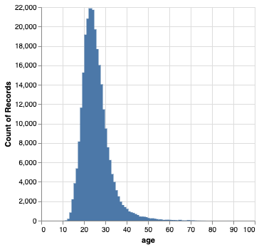
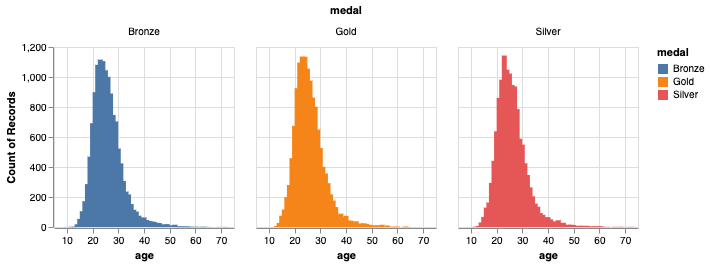

```python
import pandas as pd
import os.path

from sklearn.model_selection import (
    GridSearchCV,
    RandomizedSearchCV,
    cross_val_score,
    cross_validate,
    train_test_split,
)

import altair as alt

# Show an image where the interactive plot is not supported such as on gradescope
alt.renderers.enable('mimetype')
# Handle large data sets without embedding them in the notebook
alt.data_transformers.enable('data_server') 
```


    DataTransformerRegistry.enable('data_server')


# Project: (TBD) Olympics Medals and Age Analysis
## Exploratory Data Analysis

Here is the URL of our data source:

https://github.com/rfordatascience/tidytuesday/tree/master/data/2021/2021-07-27

Direct download links to individual CSV files:

The only file we need for our purpose:

https://github.com/rfordatascience/tidytuesday/raw/master/data/2021/2021-07-27/olympics.csv 

Other files:

https://github.com/rfordatascience/tidytuesday/raw/master/data/2021/2021-07-27/athlete_events.csv
https://github.com/rfordatascience/tidytuesday/raw/master/data/2021/2021-07-27/noc_regions.csv
https://github.com/rfordatascience/tidytuesday/raw/master/data/2021/2021-07-27/regions.csv

Based on the source page, we understand that we really need the `olympics.csv` file which is the cleaned version of the file `athlete.csv`.  The other 2 files only contains redundant information as far as our analytic objective is concerned.  So we are going to do EDA on the `olympics.csv` file here.

The data dictionary is available here:

https://github.com/rfordatascience/tidytuesday/tree/master/data/2021/2021-07-27#olympicscsv

And I am including it for your convenience:

|variable |class     |description |
|:--------|:---------|:-----------|
|id       |double    | Athlete ID |
|name     |character | Athlete Name |
|sex      |character | Athlete Sex |
|age      |double    | Athlete Age |
|height   |double    | Athlete Height in cm|
|weight   |double    | Athlete weight in kg |
|team     |character | Country/Team competing for|
|noc      |character | noc region |
|games    |character | Olympic games name |
|year     |double    | Year of olympics |
|season   |character | Season either winter or summer |
|city     |character | City of Olympic host |
|sport    |character | Sport |
|event    |character | Specific event |
|medal    |character | Medal (Gold, Silver, Bronze or NA) |

Let's load the data and find out more.


```python
local_path = "../data/raw/olympics.csv"

## Read local file if already exists, otherwise read from URL.
try:
    olympics_raw = pd.read_csv(local_path)
except:
    print("Please ensure that the following file is available:\n", local_path)
olympics_raw.info()
```

    <class 'pandas.core.frame.DataFrame'>
    RangeIndex: 271116 entries, 0 to 271115
    Data columns (total 15 columns):
     #   Column  Non-Null Count   Dtype  
    ---  ------  --------------   -----  
     0   id      271116 non-null  int64  
     1   name    271116 non-null  object 
     2   sex     271116 non-null  object 
     3   age     261642 non-null  float64
     4   height  210945 non-null  float64
     5   weight  208241 non-null  float64
     6   team    271116 non-null  object 
     7   noc     271116 non-null  object 
     8   games   271116 non-null  object 
     9   year    271116 non-null  int64  
     10  season  271116 non-null  object 
     11  city    271116 non-null  object 
     12  sport   271116 non-null  object 
     13  event   271116 non-null  object 
     14  medal   39783 non-null   object 
    dtypes: float64(3), int64(2), object(10)
    memory usage: 31.0+ MB


```python
olympics_raw.describe()
```


<div>
<style scoped>
    .dataframe tbody tr th:only-of-type {
        vertical-align: middle;
    }

    .dataframe tbody tr th {
        vertical-align: top;
    }

    .dataframe thead th {
        text-align: right;
    }
</style>
<table border="1" class="dataframe">
  <thead>
    <tr style="text-align: right;">
      <th></th>
      <th>id</th>
      <th>age</th>
      <th>height</th>
      <th>weight</th>
      <th>year</th>
    </tr>
  </thead>
  <tbody>
    <tr>
      <th>count</th>
      <td>271116.000000</td>
      <td>261642.000000</td>
      <td>210945.000000</td>
      <td>208241.000000</td>
      <td>271116.000000</td>
    </tr>
    <tr>
      <th>mean</th>
      <td>68248.954396</td>
      <td>25.556898</td>
      <td>175.338970</td>
      <td>70.702393</td>
      <td>1978.378480</td>
    </tr>
    <tr>
      <th>std</th>
      <td>39022.286345</td>
      <td>6.393561</td>
      <td>10.518462</td>
      <td>14.348020</td>
      <td>29.877632</td>
    </tr>
    <tr>
      <th>min</th>
      <td>1.000000</td>
      <td>10.000000</td>
      <td>127.000000</td>
      <td>25.000000</td>
      <td>1896.000000</td>
    </tr>
    <tr>
      <th>25%</th>
      <td>34643.000000</td>
      <td>21.000000</td>
      <td>168.000000</td>
      <td>60.000000</td>
      <td>1960.000000</td>
    </tr>
    <tr>
      <th>50%</th>
      <td>68205.000000</td>
      <td>24.000000</td>
      <td>175.000000</td>
      <td>70.000000</td>
      <td>1988.000000</td>
    </tr>
    <tr>
      <th>75%</th>
      <td>102097.250000</td>
      <td>28.000000</td>
      <td>183.000000</td>
      <td>79.000000</td>
      <td>2002.000000</td>
    </tr>
    <tr>
      <th>max</th>
      <td>135571.000000</td>
      <td>97.000000</td>
      <td>226.000000</td>
      <td>214.000000</td>
      <td>2016.000000</td>
    </tr>
  </tbody>
</table>
</div>


```python
# Let's take a sample of some rows.

olympics_raw.sample(5)
```


<div>
<style scoped>
    .dataframe tbody tr th:only-of-type {
        vertical-align: middle;
    }

    .dataframe tbody tr th {
        vertical-align: top;
    }

    .dataframe thead th {
        text-align: right;
    }
</style>
<table border="1" class="dataframe">
  <thead>
    <tr style="text-align: right;">
      <th></th>
      <th>id</th>
      <th>name</th>
      <th>sex</th>
      <th>age</th>
      <th>height</th>
      <th>weight</th>
      <th>team</th>
      <th>noc</th>
      <th>games</th>
      <th>year</th>
      <th>season</th>
      <th>city</th>
      <th>sport</th>
      <th>event</th>
      <th>medal</th>
    </tr>
  </thead>
  <tbody>
    <tr>
      <th>184193</th>
      <td>92567</td>
      <td>Heidi Pechstein (-Kunze)</td>
      <td>F</td>
      <td>16.0</td>
      <td>171.0</td>
      <td>64.0</td>
      <td>Germany</td>
      <td>GER</td>
      <td>1960 Summer</td>
      <td>1960</td>
      <td>Summer</td>
      <td>Roma</td>
      <td>Swimming</td>
      <td>Swimming Women's 100 metres Freestyle</td>
      <td>NaN</td>
    </tr>
    <tr>
      <th>208161</th>
      <td>104491</td>
      <td>Tomoyuki Sakai</td>
      <td>M</td>
      <td>21.0</td>
      <td>170.0</td>
      <td>62.0</td>
      <td>Japan</td>
      <td>JPN</td>
      <td>2000 Summer</td>
      <td>2000</td>
      <td>Summer</td>
      <td>Sydney</td>
      <td>Football</td>
      <td>Football Men's Football</td>
      <td>NaN</td>
    </tr>
    <tr>
      <th>243276</th>
      <td>121836</td>
      <td>Lucien Trepper</td>
      <td>M</td>
      <td>19.0</td>
      <td>180.0</td>
      <td>80.0</td>
      <td>Switzerland</td>
      <td>SUI</td>
      <td>1972 Summer</td>
      <td>1972</td>
      <td>Summer</td>
      <td>Munich</td>
      <td>Archery</td>
      <td>Archery Men's Individual</td>
      <td>NaN</td>
    </tr>
    <tr>
      <th>249295</th>
      <td>124822</td>
      <td>Leendert van Oosten</td>
      <td>M</td>
      <td>23.0</td>
      <td>NaN</td>
      <td>NaN</td>
      <td>Netherlands</td>
      <td>NED</td>
      <td>1908 Summer</td>
      <td>1908</td>
      <td>Summer</td>
      <td>London</td>
      <td>Wrestling</td>
      <td>Wrestling Men's Light-Heavyweight, Greco-Roman</td>
      <td>NaN</td>
    </tr>
    <tr>
      <th>18894</th>
      <td>10013</td>
      <td>Tibor Benedek</td>
      <td>M</td>
      <td>36.0</td>
      <td>190.0</td>
      <td>96.0</td>
      <td>Hungary</td>
      <td>HUN</td>
      <td>2008 Summer</td>
      <td>2008</td>
      <td>Summer</td>
      <td>Beijing</td>
      <td>Water Polo</td>
      <td>Water Polo Men's Water Polo</td>
      <td>Gold</td>
    </tr>
  </tbody>
</table>
</div>


### Points to note:

1. There are 271116 rows of data and 14 columns.  
2. The each observation as an athlete-event pair.  In other words, an athlete could participate in more than 1 event in the same Olympic game.
3. Missing values:
3.1. Most columns do not have missing values.  

3.2. `Age`, `height` and `weight` have some missing values. 

3.3. Even though `medal` appears to have a lot of missing values, but they are really not because the meaning of NaN (`NA` as in the CSV file) should mean that the athletes did not get any medal.  I think that is natural because there are very small number of medals per event!  For this EDA exercise, we may just treat `NaN` as a category together with `Gold`, `Silver` and `Bronze`
4. `id` is the unique identifier for an athlete and `noc` is the unique identifier for a NOC which mostly often represents a country except `IOA` (standing for "Individual Olympic Athlete") which is the representation for athletes without an NOC and similiarly `ROT` (standing for "Refugee Olympic Team").  

Since we focus on `age`, we are going to remove the observations where `age` is missing.


```python
olympics_df = olympics_raw[olympics_raw['age'].notna()]
```

Let's explore how age correlates with other numeric features


```python
numeric_cols_names = ['height', 
                      'weight',
                      'year']

numeric_cols_plot = alt.Chart(olympics_df).mark_point(opacity=0.3, size=10).encode(
     alt.X('age', type='quantitative', scale=alt.Scale(zero=False)),
     alt.Y(alt.repeat('column'), type='quantitative', scale=alt.Scale(zero=False)),
     color='medal:N'
).properties(
    width=150,
    height=150
).repeat(
    column=numeric_cols_names
)

numeric_cols_plot
```


    

    


It seems hard to visualize when the class imbalance is with `medal` when not having a medal is the majority.  Now we try again with the data only with medals and look at the data again.


```python
olympics_medals_df = olympics_df[olympics_df['medal'].notna()]
olympics_medals_df.shape
```


    (39051, 15)


```python
numeric_cols_names = ['height', 
                      'weight',
                      'year']

numeric_cols_plot = alt.Chart(olympics_medals_df).mark_point(opacity=0.3, size=10).encode(
     alt.X('age', type='quantitative', scale=alt.Scale(zero=False)),
     alt.Y(alt.repeat('column'), type='quantitative', scale=alt.Scale(zero=False)),
     color='medal:N'
).properties(
    width=150,
    height=150
).repeat(
    column=numeric_cols_names
)

numeric_cols_plot
```


    

    


Some high-level insights:

1. There is some apparently correlation of between height and age and between weight and age for those who got medals; and
2. The maximum age of athletes getting medals seemed to shrink between 1960s and 1980s, and it seemed to increase again till now.

Perhaps we should simply just look at the relationship between age and medals...


```python
age_medals_hist = alt.Chart(olympics_medals_df).mark_bar().encode(
    alt.X('age:Q', scale=alt.Scale(zero=False)),
    alt.Y('count()'),
    color=('medal'),
    tooltip=['age', 'medal', 'count()']
).properties(
    width=180,
    height=180
).facet(
    facet='medal:N',
    columns=3
)
age_medals_hist
```


    

    


All the modes for `Gold`, `Silver` and `Bronze` are age = 23.

Now let's also explore the categorical features.


```python
cat_cols = ['sex',
            'season',
            'noc',
            'games',
            'city',
            'sport',
            'event']

cat_plots = alt.Chart(olympics_medals_df).mark_boxplot().encode(
    x=alt.X('age', type='quantitative'),
    y=alt.Y(alt.repeat('row'), type='nominal'),
    color='medal:N',
    tooltip=['age']
).properties(
    height=300,
    width=150
).facet(
    facet='medal:N',
    columns=3
).repeat(
    row=cat_cols
)

cat_plots
```


    

    


## Comments by categorical features:

1. `Sex` - The male medalists seem to have a higher mean age than female counterparts but not by a lot.  The age distribution of male medalists is also more right-skewed compared with female medalists;
2. `season` - The age spread is larger for `summer` over `winter` and the distribution of `summer` is more right-skewed than `winter`.

I know that the labels are not very readable, but for the other categorical features, namely `noc`, `games`, `city`, `sport` and `event`, and for the purpose of this EDA, it is just to show that:
1. `age` varies greatly across those categorical features.  
2. The 3 medals apparently to distribute very similarly with all those features.
